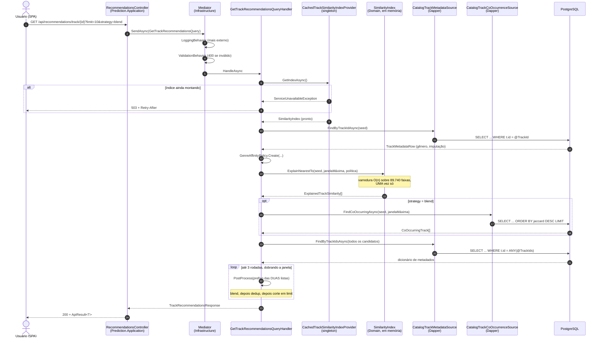
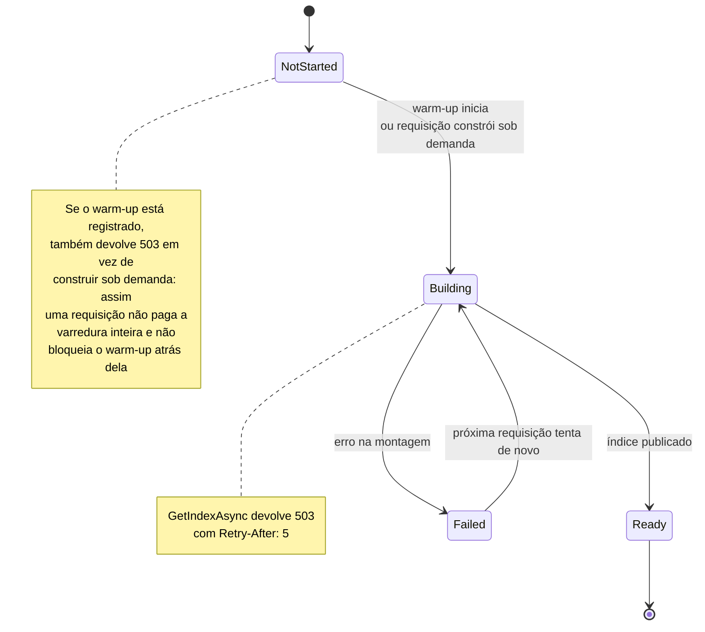
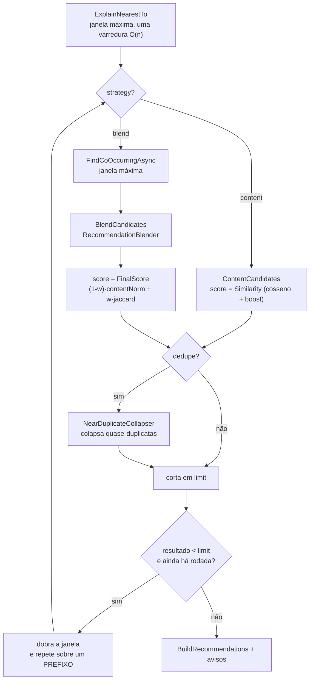
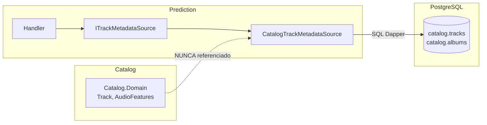
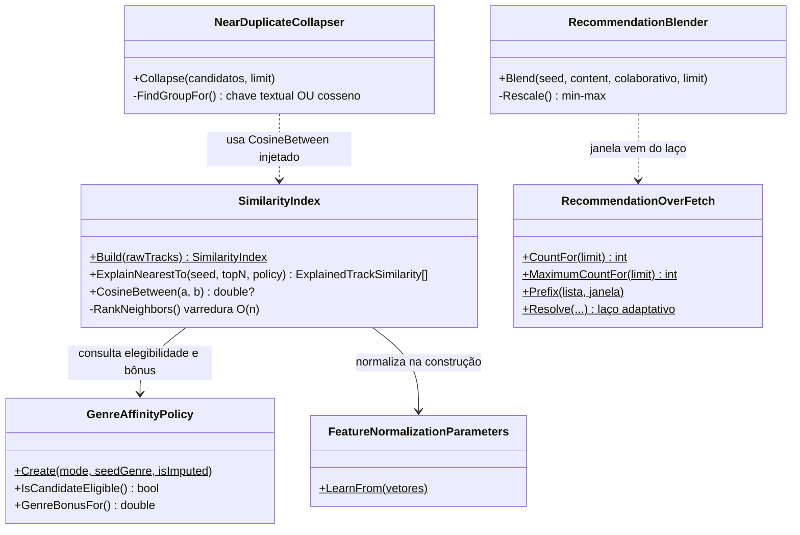
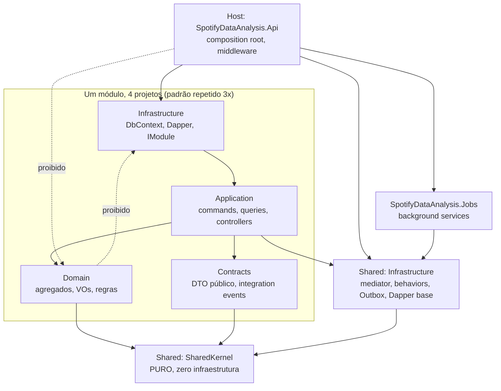
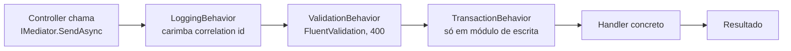
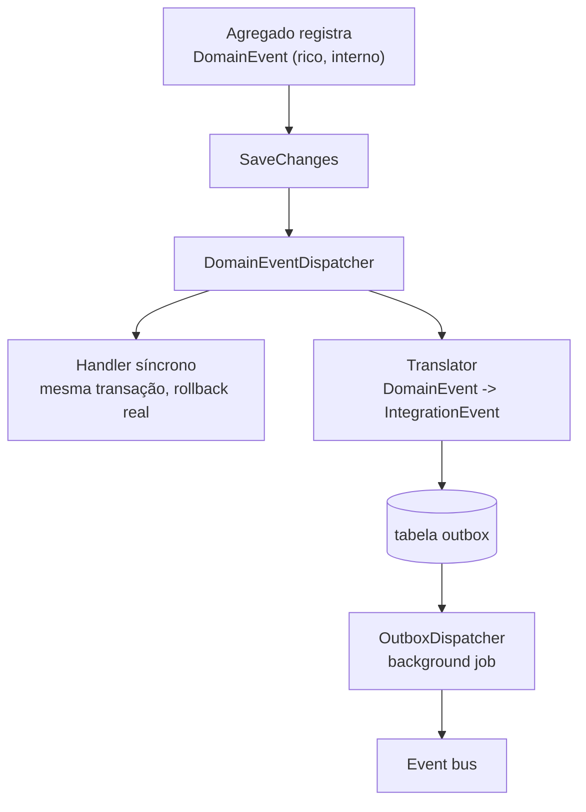

# Como este projeto funciona

> Material de estudo do próprio código. Não é README (aquele vende o projeto) nem
> `CLAUDE.md` (aquele instrui agentes). Aqui o objetivo é um só: você conseguir
> abrir qualquer arquivo deste repositório e saber por que ele existe.
>
> Os diagramas são Mermaid, então renderizam no GitHub e no VS Code, e são texto:
> quando o código mudar, o diagrama aparece no diff em vez de apodrecer em silêncio.

**Estratégia de leitura.** A Parte 1 segue **uma** requisição real de ponta a ponta,
com nome de classe e de arquivo. É a parte que importa. A Parte 2 mostra que o resto
do projeto é esse mesmo padrão repetido, então ela pode ser lida rápido. A Parte 3
lista onde a documentação do projeto diverge do código.

---

## Sumário

- [Parte 1: a fatia vertical](#parte-1-a-fatia-vertical)
  - [O caminho inteiro em um diagrama](#o-caminho-inteiro-em-um-diagrama)
  - [Passo a passo](#passo-a-passo)
  - [Quem decide o quê no Domain](#quem-decide-o-quê-no-domain)
  - [As sutilezas que custaram caro](#as-sutilezas-que-custaram-caro)
- [Parte 2: o mapa](#parte-2-o-mapa)
  - [Grafo de projetos](#grafo-de-projetos)
  - [O pipeline CQRS](#o-pipeline-cqrs)
  - [Write-side e read-side](#write-side-e-read-side)
  - [Eventos](#eventos)
  - [Os três módulos](#os-três-módulos)
  - [O que o build defende sozinho](#o-que-o-build-defende-sozinho)
- [Parte 3: divergências entre a documentação e o código](#parte-3-divergências-entre-a-documentação-e-o-código)
- [Onde mexer para cada tipo de tarefa](#onde-mexer-para-cada-tipo-de-tarefa)

---

# Parte 1: a fatia vertical

O endpoint escolhido é `GET /api/recommendations/track/{id}`. Ele foi escolhido porque
é o mais rico do projeto: passa por HTTP, mediator, Application, Domain puro, um índice
em memória, duas consultas Dapper e a SPA. Se você entender este caminho, os outros são
o mesmo esqueleto com menos carne.

## O caminho inteiro em um diagrama



## Passo a passo

### 1. O controller, que não mora onde você espera

`src/Modules/Prediction/...Application/Controllers/RecommendationsController.cs`

**Surpresa número um:** os controllers **não** estão no `Host`. Cada módulo expõe os
seus dentro do próprio `Application`, e o `Host` apenas hospeda o processo. Confira:
todos os sete controllers do projeto estão em `*.Application/Controllers/`.

Consequência prática: a camada `Application` de um módulo referencia ASP.NET. Isso é
permitido (as regras de arquitetura proíbem ASP.NET só no `Domain`), mas é bom saber,
porque contraria a leitura ingênua de "Application é agnóstica de transporte".

O controller declara o contrato inteiro em atributos, incluindo os caminhos de erro:

```csharp
[ProducesResponseType(typeof(ApiResult<TrackRecommendationsResponse>), 200)]
[ProducesResponseType(typeof(ValidationProblemDetails), 400)]
[ProducesResponseType(typeof(ProblemDetails), 404)]
[ProducesResponseType(typeof(ProblemDetails), 422)]
[ProducesResponseType(typeof(ProblemDetails), 503)]
```

Esses cinco status não são decoração. Cada um tem dono na cadeia abaixo.

### 2. O mediator e o pipeline

`src/Shared/SpotifyDataAnalysis.Infrastructure/Messaging/Mediator.cs`

O projeto **não usa MediatR**. Tem mediator próprio: resolve o handler por reflexão,
com cache em `ConcurrentDictionary`, e envolve a chamada nos `IPipelineBehavior`
registrados.

**Surpresa número dois, e é a mais fácil de errar:** a ordem real é

```
LoggingBehavior  →  ValidationBehavior  →  [TransactionBehavior]  →  handler
```

O primeiro behavior **registrado** vira o **mais externo**. Em
`InfrastructureServiceExtensions.cs` o `LoggingBehavior` é registrado antes do
`ValidationBehavior`, então log é o de fora. O `CLAUDE.md` diz "Validation → Logging →
Transaction", o que está invertido (ver a [Parte 3](#parte-3-divergências-entre-a-documentação-e-o-código)).

O `TransactionBehavior` **não** é registrado globalmente, de propósito: ele depende de
`IUnitOfWork`, que é escolha de cada módulo de escrita. Prediction é read-only nesta
fatia, então ele nem entra.

### 3. A query e o handler

`.../Application/Recommendations/GetTrackRecommendationsQuery.cs`

Um arquivo, três coisas: o record da query (com os defaults e os tetos como constantes),
o handler, e os tipos privados de apoio. Essa colocação é o padrão do read-side aqui.

O handler depende de **três portas**, todas interfaces declaradas no Application:

| Porta | Quem implementa | Onde |
|---|---|---|
| `ITrackSimilarityIndexProvider` | `CachedTrackSimilarityIndexProvider` | Prediction.Infrastructure |
| `ITrackMetadataSource` | `CatalogTrackMetadataSource` | Prediction.Infrastructure |
| `ITrackCoOccurrenceSource` | `CatalogTrackCoOccurrenceSource` | Prediction.Infrastructure |

Repare no nome das duas últimas: elas leem o schema `catalog`, mas vivem em
`Prediction.Infrastructure`. Isso é deliberado e é o coração da regra de fronteira,
explicado no passo 7.

A sequência dentro de `HandleAsync`:

1. **Re-clampa** `limit` e `explainTopK` mesmo já tendo passado pelo validador. Defesa em
   profundidade: nenhuma camada confia na anterior.
2. **Pega o índice.** Se ainda estiver montando, propaga `ServiceUnavailableException`.
3. **Carrega a semente** pelo metadado, para saber gênero e se as features são imputadas.
4. **Monta a política de gênero** com esses dados.
5. **Calcula a janela máxima** de over-fetch.
6. **Varre o índice uma vez** na janela máxima.
7. **Busca co-ocorrência** apenas se a estratégia for blend.
8. **Carrega metadados em lote**, uma ida só, para todos os candidatos.
9. **Roda o laço adaptativo** de pós-processamento.
10. **Monta a resposta** com avisos.

### 4. O índice, e por que ele é singleton

`.../Infrastructure/Recommendations/CachedTrackSimilarityIndexProvider.cs`

O índice de similaridade é um objeto em memória com 89.740 vetores normalizados.
Construí-lo custa uma varredura completa do catálogo, então ele é **singleton** e
montado **uma vez**, em background, no arranque.

Isso cria um estado que a API precisa expor com honestidade:



O `SimilarityIndexWarmUpService` é um `BackgroundService` que avisa o provider no
**construtor**, não no `ExecuteAsync`. Isso importa: o host resolve todos os
`IHostedService` **antes** de subir o Kestrel, então quando a primeira requisição chega,
o provider já sabe que um warm-up está a caminho.

### 5. O funil, que é onde mora a lógica de verdade



O ponto sutil: **as rodadas não refazem a varredura**. A varredura é O(n) sobre 89.740
faixas e aconteceu uma vez só, na janela máxima. Cada rodada pós-processa um **prefixo**
dela. Isso é exato, não aproximado, porque o heap de vizinhos desempata totalmente por
`trackId`, então o prefixo de tamanho N é exatamente o que uma segunda varredura
devolveria.

E a janela corta **as duas** listas, a de áudio e a colaborativa. Cortar só uma foi um
bug real, corrigido no commit `b226f7a`.

### 6. A resposta

Envelope padrão de toda a API (`ApiResult<T>` no SharedKernel):

```json
{
  "success": true,
  "message": "Faixas recomendadas por similaridade híbrida (áudio + gênero).",
  "data": {
    "seedTrackId": "...", "seedName": "Creep", "seedGenre": "alt-rock",
    "effectiveStrategy": "Blend",
    "collaborativeSignalUnavailable": false,
    "dedupeApplied": true, "totalDuplicatesCollapsed": 3,
    "recommendations": [ { "trackId": "...", "score": 0.65, "cosineScore": 0.9855, "genreBoost": 0.0, "topFeatures": [...] } ],
    "warnings": []
  }
}
```

**Atenção a duas armadilhas de forma**, que já me fizeram escrever código errado:

- Recomendações vêm em `data.recommendations`, **não** em `data.items`. Já `/api/tracks`
  pagina em `data.items`. Os dois endpoints têm formas diferentes de propósito.
- Em `/api/tracks` os campos são `trackId` e `primaryArtist`, **não** `id` e `artist`.

E a armadilha semântica, que é a mais importante do projeto inteiro:

> **`score` significa coisas diferentes por estratégia.**
> Em `content`, `score = cosineScore + genreBoost` e a soma fecha.
> Em `blend`, `score` é o score final do blender normalizado, e a soma **não** fecha.

Isso é intencional (um número só ordena e aparece), mas a SPA exibia "cosine + genre"
embaixo do score em ambos os casos, afirmando uma conta falsa. Corrigido em `9b948f8`.

### 7. A fronteira entre módulos, na prática

Prediction precisa de dados que moram no Catalog. Como ele os obtém?



Prediction **nunca** dá `using SpotifyDataAnalysis.Modules.Catalog...`. Ele lê o schema
`catalog` por SQL, dentro da própria Infrastructure, atrás de uma porta que o Application
declarou. O acoplamento existe, mas é por **dado**, não por tipo, e está confinado a um
arquivo.

O preço disso é honesto e vale saber: existe conhecimento duplicado. A chave de dedup do
Prediction reimplementa a mesma normalização do `TrackMatchKey` do Catalog, sem
referenciá-lo. Isso é escolha, não descuido.

## Quem decide o quê no Domain



Cada tipo tem uma responsabilidade e uma **não** responsabilidade:

| Tipo | Decide | Não é dele |
|---|---|---|
| `SimilarityIndex` | quem são os vizinhos e quão parecidos | de onde vêm os dados, quando reconstruir |
| `GenreAffinityPolicy` | quem é elegível e quem ganha bônus | como ordenar o resultado |
| `RecommendationOverFetch` | quantos candidatos buscar e quando alargar | o que fazer com eles |
| `RecommendationBlender` | como misturar áudio e co-ocorrência | de onde vem a co-ocorrência |
| `NearDuplicateCollapser` | o que é a mesma faixa em versões diferentes | como medir semelhança (recebe injetado) |

## As sutilezas que custaram caro

Estas não se descobrem lendo o código de primeira. Cada uma foi um bug.

1. **Um número só ordena e aparece.** Se o ranking ordena por A e a resposta exibe B, o
   usuário recebe uma ordem que não consegue explicar. Foi assim que o boost de gênero
   passou dois épicos sendo calculado e descartado.

2. **O instrumento de medição também erra.** O avaliador de qualidade reimplementa o
   funil de produção. Quando o handler mudou e o avaliador não, o gate continuou verde
   medindo um sistema que o endpoint não entregava mais. Duplicação sem acoplamento de
   compilação é dívida que vence em silêncio.

3. **Teste verde não é prova.** Quatro regras de arquitetura avaliavam zero tipos por
   vários épicos. O que segurava a pureza do SharedKernel era o `.csproj` sem
   referências, não o teste. A prova de uma regra é vê-la **vermelha** com uma violação
   injetada de propósito.

4. **Limiar calibrado numa população só vale naquela população.** O gate cobrava "menos
   de 5% de listas curtas" comparando configuração e top-N, mas não a amostra. Trocar a
   amostra tornava o limiar trivial.

5. **`/health` 200 não significa pronto.** O índice sobe em background. Medir antes dele
   ficar pronto mede 503, não latência.

---

# Parte 2: o mapa

Agora que a fatia está clara, o resto é reconhecimento de padrão.

## Grafo de projetos



As linhas pontilhadas são o que os testes de arquitetura impedem. Os três módulos
(`Catalog`, `Analytics`, `Prediction`) repetem exatamente essa estrutura de quatro
projetos.

## O pipeline CQRS



Cada command tem o **seu** handler. Não existe handler genérico multiuso. Os handlers
são descobertos por reflexão a partir do assembly do módulo
(`AddHandlersFromAssembly`).

## Write-side e read-side

A divisão é rígida e vale memorizar:

| | Write-side | Read-side |
|---|---|---|
| Tipo | `ICommand` | `IQuery` |
| Acesso a dados | **EF Core**, via `DbContext` do módulo | **Dapper**, via `BaseDataAccess` |
| Onde mora | Application do módulo, com o agregado no Domain | Query, Handler e Result no **mesmo arquivo** |
| Transação | `TransactionBehavior` + `IUnitOfWork` | nenhuma |
| Paginação | não se aplica | `ROW_NUMBER() OVER()` + `COUNT(*) OVER()` numa CTE |

Uma armadilha registrada na memória do projeto: `COUNT(*) OVER()` do PostgreSQL devolve
`bigint`, que materializa como `long`. Tipar como `int` compila, passa nos testes de
contrato (que só afirmam o texto do SQL) e dá 500 em 100% das chamadas.

## Eventos



A regra de escolha: **efeito colateral** (sincronizar módulos, disparar job, chamada
externa) vai pelo Outbox, e falhar ali não derruba a operação principal. **Invariante de
negócio que exige atomicidade cross-domínio** usa handler síncrono, com parcimônia.

`DomainEvent` é interno e rico. `IntegrationEvent` é público, achatado, mora em
`Contracts`, e é traduzido antes de publicar. Os dois não são a mesma coisa.

## Os três módulos

| Módulo | Responsabilidade | Domain tem | Casos de uso típicos |
|---|---|---|---|
| **Catalog** | ingestão e manutenção do catálogo | `Track`, `Artist`, `Album`, `Playlist`, VOs como `AudioFeatures`, `TrackMatchKey`, `Popularity` | `IngestPlaylistCommand`, `ImportKaggleAudioFeaturesCommand`, `SearchTracksQuery` |
| **Analytics** | insights agregados, leitura pura | quase nada, é read-side | `GetCatalogSummaryQuery`, `GetPopularityRankingQuery`, `GetFeaturePopularityCorrelationsQuery` |
| **Prediction** | ML.NET e recomendações | `ModelVersion`, `SimilarityIndex`, `GenreAffinityPolicy`, `RecommendationBlender` | `TrainPopularityModelCommand`, `PredictPopularityCommand`, `GetTrackRecommendationsQuery` |

Um módulo se pluga no Host implementando `IModule` (`Order` define a sequência de
registro: Catalog 0, Analytics 1, Prediction 2), e o `ModuleLoader` os descobre por
reflexão.

## O que o build defende sozinho

São **43 regras** ArchUnitNET, e elas falham o `dotnet test` no instante em que:

- o `Domain` de um módulo toca `Domain`, `Application` ou `Infrastructure` de outro;
- o `Domain` referencia EF Core, Dapper ou ASP.NET;
- o `SharedKernel` referencia qualquer infraestrutura;
- o `Host` referencia o `Domain` interno de um módulo;
- `Contracts` referencia `Domain`.

Existe também uma regra que existe só para as outras não passarem por vacuidade: ela
verifica que os assemblies de Domain **foram descobertos**. Sem ela, uma regra genérica
sobre conjunto vazio passa alegremente.

Duas armadilhas da API do ArchUnitNET, que já produziram quatro testes falsos:

- `ResideInAssembly(string)` compara com o **`FullName`** do assembly. Passar o nome
  simples seleciona zero tipos.
- `ResideInNamespace(string)` é correspondência **exata**, não prefixo. `"Microsoft.AspNetCore"`
  nunca casa, porque os tipos moram em sub-namespaces.

---

# Parte 3: divergências entre a documentação e o código

Achadas conferindo o código para escrever este documento. Valem mais que o resto,
porque são exatamente onde a intuição erra.

| Afirmação no `CLAUDE.md` | O que o código faz | Impacto |
|---|---|---|
| pipeline "Validation → Logging → Transaction" | **Logging → Validation → Transaction**. O primeiro registrado é o mais externo, e `LoggingBehavior` é registrado primeiro | log envolve a validação, então uma requisição que falha na validação **aparece** no log. Na ordem documentada, não apareceria |
| `TransactionBehavior` no pipeline | **não é registrado globalmente**, é por módulo de escrita, porque depende de `IUnitOfWork` | queries nunca pagam transação, e isso é escolha |
| roteamento diz "api-endpoint-specialist: Host/Api: endpoint" | os controllers moram em **`*.Application/Controllers/`** de cada módulo | ao adicionar endpoint, você mexe no módulo, não no Host |
| "as 42 regras do ArchitectureTests" | são **43** desde `d50238e` | contagem, não conceito |

Nenhuma dessas é bug. São documentação desatualizada, e a lista existe para você não
perder tempo procurando controller no Host.

---

# Onde mexer para cada tipo de tarefa

| Quero... | Mexo em | Cuidado |
|---|---|---|
| adicionar endpoint | `*.Application/Controllers/` do módulo, mais a query ou command | declare os `ProducesResponseType` de erro, não só o 200 |
| adicionar regra de negócio | `*.Domain/` do módulo | Domain não conhece EF, Dapper nem ASP.NET |
| adicionar leitura paginada | um arquivo novo em `*.Application/`, com Query, Handler e Result juntos | Dapper, `COUNT(*) OVER()` como `long`, e smoke contra Postgres real antes do done |
| mudar schema | `*.Infrastructure/Persistence/`, mais migration | mapeamento snake_case; VO com `ToJson` precisa de setter privado |
| mexer no recomendador | `Prediction.Domain/Recommendations/` | se mudar o funil, o avaliador de qualidade tem uma cópia dele que precisa mudar junto |
| mexer na SPA | `frontend/src/` | os quatro gates (typecheck, lint com zero aviso, test, build) |
| rodar tudo | a skill `/run-spotify-data-analysis` | frontend **tem** que ser 5173, por causa do CORS fixo |

---

## Para continuar

- `CLAUDE.md` tem as regras invioláveis e a tabela de especialistas.
- `.claude/memory/` guarda as lições que custaram caro, com a evidência.
- `.claude/skills/run-spotify-data-analysis/` sobe e dirige o projeto.
- `README.md` tem os números medidos (qualidade do recomendador, pegada em free tier).
