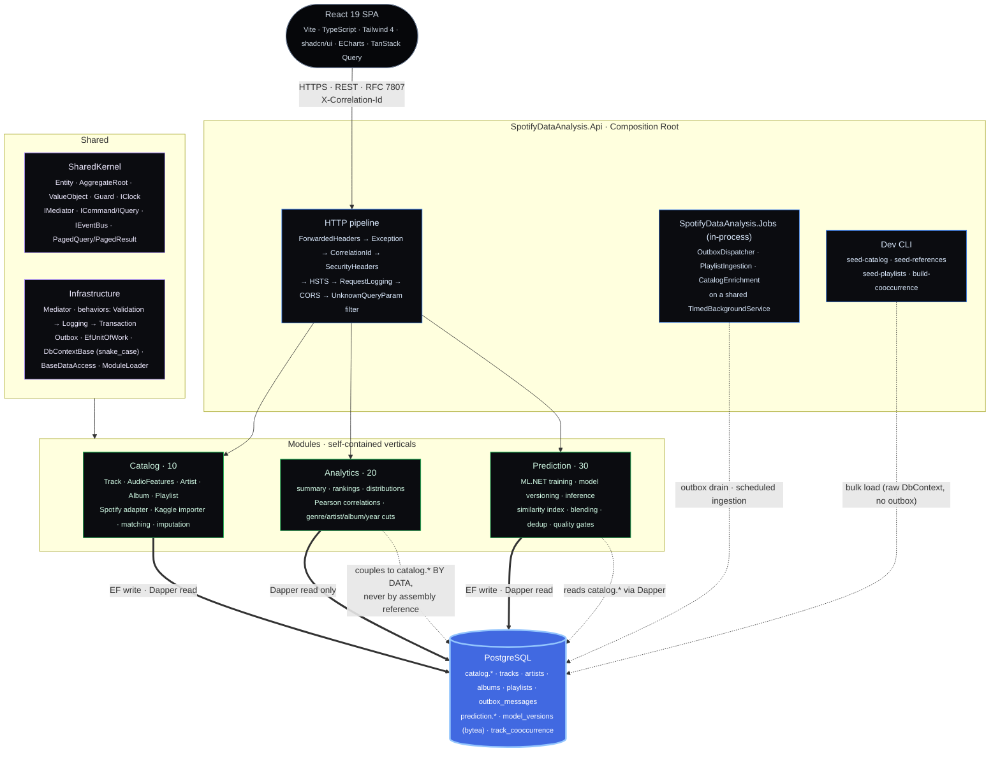
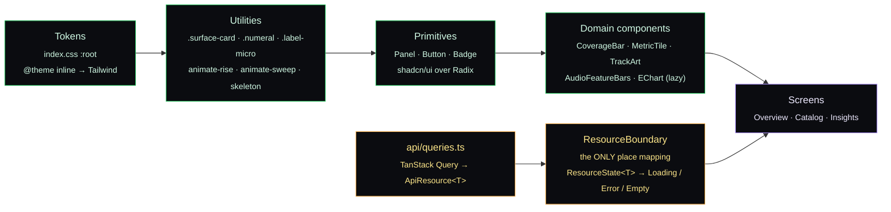

<h1 align="center">Spotify Data Analysis</h1>

<p align="center">
  <i>An end-to-end <b>data product</b> in .NET 8: resilient ingestion, EDA as a service, a<br/>
  <b>served ML model</b> and an <b>explainable recommender</b> over 89,740 tracks. DDD, CQRS and a<br/>
  modular monolith, with every claim in this README backed by a measurement in the repo.</i>
</p>

<p align="center">
  <a href="https://REPLACE-WITH-DEMO-URL">
    
  </a>
  <a href="https://github.com/KauaVilasBoas/Spotify-Data-Analysis/actions/workflows/ci.yml">
    
  </a>
  
  
  
  
  <a href="https://www.conventionalcommits.org/">
    
  </a>
  <a href="LICENSE">
    
  </a>
</p>

<p align="center">
  <b>89,740</b> tracks &nbsp;·&nbsp; <b>1.48M</b> co-occurrence pairs &nbsp;·&nbsp; <b>723</b> tests &nbsp;·&nbsp; <b>42</b> architecture rules &nbsp;·&nbsp; <b>MAE 11.54</b> (33.1% below baseline)
</p>

<p align="center">
  <a href="#what-is-this">Why</a> &nbsp;·&nbsp;
  <a href="#architecture-at-a-glance">Architecture</a> &nbsp;·&nbsp;
  <a href="#the-data-pipeline">Pipeline</a> &nbsp;·&nbsp;
  <a href="#measured-not-claimed">Measurements</a> &nbsp;·&nbsp;
  <a href="#quality-gates">Gates</a> &nbsp;·&nbsp;
  <a href="#engineering-decisions">Decisions</a> &nbsp;·&nbsp;
  <a href="#design-system">Design</a> &nbsp;·&nbsp;
  <a href="#getting-started">Run it</a> &nbsp;·&nbsp;
  <a href="#known-limitations">Limits</a>
</p>

---

## What is this?

The brief was the standard data-analysis exercise: pull from the Spotify API, clean the data, run an
EDA, plot some charts, predict popularity, recommend similar tracks. The usual answer is a Jupyter
notebook.

**This is that brief taken to the end of the road.** The notebook became a system: a .NET 8 modular
monolith where ingestion is idempotent and resilient, the EDA is a paginated read-side over raw SQL,
the model is versioned and served behind an endpoint, and the recommender explains *why* it picked
each track, with a React SPA on top of all of it.

The interesting part is not the architecture, though. It is that **the project refuses to claim
anything it has not measured.**

> A one-hot encoding of `key` / `mode` / `time_signature` was added to the feature set, measured, and
> **deleted**, because it made MAE 0.12% *worse*. The genre block was measured in the same run, paid
> 23.92%, and stayed. The decision is a domain rule (`FeatureBlockGainPolicy`: a block survives only
> if it wins at least 2% of MAE on its own), not a judgement call.

That pattern repeats everywhere. The recommender's genre-boost weight went from `0.15` to `0.05`
because measurement showed that `0.15` made 82% of seeds return a single-genre top-10, a hard filter
wearing a boost costume. The model's quality gate is *relative to a baseline* rather than an absolute
MAE threshold, because only the comparison answers "did it learn anything?".

### Highlights

- **Two-sided quality gate on the recommender.** This is the design decision I would defend first. A
  floor-only gate ("coherence at least X") is trivially satisfied by cranking the genre boost until it
  becomes a hard filter, which would reward the exact failure being diagnosed. So coherence is charged
  on three fronts: an absolute floor, a **minimum lift** over pure cosine (the boost must be doing
  something), and a **saturation ceiling** (it must not erase genre diversity). Too little weight
  fails the lift; too much fails the saturation.
- **Honest baselines, reported as a table.** The model is measured against *two* baselines
  (always-predict-the-mean, and a linear SDCA regressor) on a held-out test set, with 5-fold
  cross-validation and a fixed seed. Two runs with the same seed produced an identical MAE down to the
  last decimal.
- **Provenance is a first-class type.** `measured`, `imputed` and `absent` never share a colour, a
  label or a code path. Imputed tracks are excluded from training by a named policy
  (`ImputedFeaturePolicy.ExcludeImputed`), because median imputation compresses variance and lets the
  model learn "this feature equals genre X's median" as a genre proxy: right answer, wrong reason.
- **Explainable recommendations.** Every item carries its cosine score, the genre boost *separately*
  so the boost is auditable, the top-K features that pulled it close with their original values, how
  many playlists it co-occurs in, and which signal backed it (`content`, `collaborative` or
  `blended`). Degradations are never silent: the response echoes the *effective* strategy and genre
  mode.
- **Collaborative signal without user data.** Item-item co-occurrence mined from 37,121 real
  playlists, Jaccard-scored and **materialised** into `prediction.track_cooccurrence` (1,481,511
  pairs) by a batch step. The request path reads that table; it never self-joins over jsonb.
- **Boundaries enforced by the build.** 42 ArchUnitNET facts fail `dotnet test` the moment a module
  reaches into another module's internals, or Domain touches EF Core, Dapper or ASP.NET.
- **Measured operations.** RAM ceiling, boot time, p95 latency and cold start were benchmarked in a
  container at 256 MB and 512 MB, at full and throttled CPU. The conclusion is recorded in
  [`deploy/DEPLOY.md`](deploy/DEPLOY.md): the free-tier bottleneck here is **CPU and disk, not RAM**.

---

## Live demo

**[REPLACE-WITH-DEMO-URL](https://REPLACE-WITH-DEMO-URL)**, read-only, seeded with the full public
dataset. The API exposes `/health`; Swagger is development-only by design.

<!--
  SCREENSHOTS: drop three PNGs in docs/screenshots/ and uncomment this block.
    overview.png   the Overview page (the big number above the fold plus top tracks)
    insights.png   the Insights page (correlation panel plus distribution histogram)
    catalog.png    the Catalog page (track search plus the detail panel with generated art)


| Insights | Catalog |
|---|---|
|  |  |
-->

---

## Architecture at a glance



<sub><b>Reading the diagram.</b> The Host composes modules by assembly scan (<code>ModuleLoader</code>, ordered by <code>IModule.Order</code>); each module's <code>IModule</code> lives in its Infrastructure project, so the dependency direction stays Infrastructure → Application → Domain and the Host never sees a module's Domain. Thick arrows are EF Core / Dapper I/O; dashed arrows are background access and data coupling. <b>Analytics deliberately has no schema of its own</b>: it reads <code>catalog.*</code> with raw SQL. That is coupling by <i>data</i>, not by code, since no Analytics assembly references any Catalog type, which is exactly what the architecture tests assert. Calling it out is the point; pretending otherwise would be the smell.</sub>

---

## The data pipeline

The Spotify Web API **removed the audio-features endpoint in November 2024**, and that single
constraint shaped the whole project. Audio features come from a public Kaggle dataset instead, and the
playlist co-occurrence signal from a second one. Neither CSV is versioned here.

```mermaid
flowchart LR
    subgraph SRC["Sources"]
        KG[/"Kaggle · Spotify Tracks<br/><sub>maharshipandya · ~114k rows<br/>audio features + genre</sub>"/]
        PI[/"Kaggle · Spotify Playlists<br/><sub>Pichl et al. · ~1.18 GB<br/>user_id · playlist · artist · track</sub>"/]
        API[/"Spotify Web API<br/><sub>Client Credentials · retry/backoff<br/>429 + Retry-After · pagination</sub>"/]
    end

    subgraph ING["Ingestion · Catalog"]
        SC["seed-catalog<br/><sub>tracks + measured features</sub>"]
        SR["seed-references<br/><sub>artists + albums, linked</sub>"]
        SP["seed-playlists<br/><sub>streamed, grouped, matched<br/>by normalised TrackMatchKey</sub>"]
        IN["IngestPlaylistCommand<br/><sub>idempotent · Outbox</sub>"]
        MT["TrackMatcher<br/><sub>track_id → artist+title → +duration</sub>"]
        IM["MedianAudioFeatureImputer<br/><sub>genre median → global median<br/>marks IsImputed</sub>"]
    end

    CATDB[("catalog.*<br/><sub>89,740 tracks · 29,811 artists<br/>57,637 albums · 37,121 playlists · 113 genres</sub>")]

    subgraph ML["Prediction"]
        DS["TrainingDatasetAssembler<br/><sub>deterministic hash split, seed 20260730<br/>71,762 train / 17,978 test</sub>"]
        TR["FastTree regression<br/><sub>plus mean and linear baselines</sub>"]
        EL["FeatureSetChampionElection<br/><sub>a block survives only if it wins<br/>at least 2% MAE on its own</sub>"]
        MV[("prediction.model_versions<br/><sub>bytea + metrics + feature importance</sub>")]
        SI["SimilarityIndex<br/><sub>z-score → cosine → kNN top-N<br/>built in memory on first call</sub>"]
    end

    CO["build-cooccurrence<br/><sub>pairs in 2+ playlists → Jaccard</sub>"]
    CODB[("prediction.track_cooccurrence<br/><sub>1,481,511 pairs · 254 MB</sub>")]

    subgraph OUT["Served"]
        EDA["/api/insights/*<br/><sub>Dapper · ROW_NUMBER() + COUNT(*) OVER()</sub>"]
        PRED["/api/predictions/popularity"]
        REC["/api/recommendations/track/:id<br/><sub>strategy=content or blend</sub>"]
    end

    KG --> SC --> CATDB
    KG --> SR --> CATDB
    PI --> SP --> CATDB
    API --> IN --> CATDB
    SC -.-> MT
    SP -.-> MT
    MT -.-> IM -.-> CATDB

    CATDB --> DS --> TR --> EL --> MV --> PRED
    CATDB --> SI --> REC
    CATDB --> CO --> CODB --> REC
    CATDB --> EDA

    classDef src   fill:#06070a,stroke:#f0a742,color:#fde68a
    classDef step  fill:#0b0c10,stroke:#1DB954,color:#d1fae5
    classDef ml    fill:#0b0c10,stroke:#a78bfa,color:#ede9fe
    classDef out   fill:#0b0c10,stroke:#3b82f6,color:#dbeafe
    classDef db    fill:#4169E1,stroke:#93c5fd,color:#ffffff,stroke-width:3px

    class KG,PI,API src
    class SC,SR,SP,IN,MT,IM,CO step
    class DS,TR,EL,SI ml
    class EDA,PRED,REC out
    class CATDB,MV,CODB db
```



**Track matching** is a chain of strategies, not a single join: exact `track_id` first, then
normalised `artist + title`, then `title + duration` to break homonyms. Every run reports its **match
rate**, fallback share, duplicates and imputation rate, because a load that silently half-worked is a
load that failed.

---

## Measured, not claimed

Everything below is reproduced by `dotnet test` (deterministic fixtures) or by re-running the training
endpoint against the seeded catalogue with the recorded seed.

### Popularity model: champion election

Same split, same seed (`20260730`), same trainer (FastTree). Four feature sets measured, one elected.

| Feature set | R² | MAE | RMSE | MAE gain | Verdict |
|---|---:|---:|---:|---:|---|
| Baseline, always predict the mean | -0.0001 | 17.2555 | 20.5634 | n/a | reference |
| Baseline, linear (SDCA) | 0.0358 | 16.6640 | 20.1900 | n/a | reference |
| Base: 9 audio features + duration + explicit | 0.1519 | 15.1680 | 18.9356 | n/a | starting point |
| **+ A**: key / time-signature one-hot, mode boolean | 0.1524 | 15.1862 | 18.9303 | **-0.12%** | ❌ does not pay, **removed** |
| **+ B**: genre one-hot (113 plus an `<unknown>` bucket) | **0.3927** | **11.5396** | **16.0240** | **+23.92%** | ✅ **champion** |
| A + B | 0.3949 | 11.5076 | 15.9945 | n/a | carries a rejected block |

**Champion: base plus genre.** Against the mean baseline that is **MAE 33.1% lower**. 5-fold
cross-validation puts R² dispersion at **0.0046**, which is what licenses reading the
feature-importance ranking as a learned mechanism rather than a ranking of noise.

The result contradicted the project's own prior. At the EDA stage the strongest Pearson correlation
against popularity was **0.127**, and the prediction on record was that the gate would fail. Weak
*linear* correlation is not absence of signal: FastTree picks up non-linearity and feature interaction
that Pearson cannot see, and `duration_ms` / `explicit` were not even in the correlation run.

**Feature importance** is measured once at training time by permutation over the test set (5
permutations per slot), stored as jsonb alongside the version and served by `GET /api/model/current`.
The 113 genre columns are aggregated into a single `Genre` row, where means add and dispersions add in
quadrature, because each permutation is an independent draw. The endpoint's own documentation states
the caveat: with correlated features (Energy against Loudness, measured at EDA time), low importance
means *"the model did not need this column given the rest of the vector"*, never *"this quantity is
unrelated to popularity"*.

### Recommender: three verifiable proxies

There is no user ground truth, so quality is measured by proxies over the real catalogue. Fixed,
seeded sample: **300 seeds, top-10**.

| Proxy | Cosine only | With the elected boost | Reads as |
|---|---:|---:|---|
| Genre coherence | 0.1347 | **0.5833** | 4.33x lift, the boost is actually breaking ties |
| Genre saturation (top-N all one genre) | n/a | **0.3100** | minority, so still a boost and not a filter |
| Self-exclusion violations | 0 / 300 | 0 / 300 | the seed never recommends itself |
| Duplicate recall | n/a | 0.6108 | near-duplicates land in the top-K |
| Duplicate hit rate | n/a | 0.6745 | share of seeds with at least one sibling found |
| Mean sibling cosine | n/a | 0.998244 | the most sensitive break detector in the suite |

Proxy 3 (duplicate proximity) is **always measured with genre switched off**, because it is the only
non-circular guard. Genre coherence measured over a genre-boosted ranking partly measures the boost
itself; duplicate proximity does not use genre at all, so if normalisation or the cosine break, it is
the first to fall. It is anchored on `catalog.tracks.match_key`, verified by SQL before use: **7,015
groups, 19,388 tracks, 36,940 pairs, largest group 54**, the same number that sized the dedup work.

### Free-tier footprint

Container `spotifydataanalysis-api` against Postgres with the full dataset. Full runbook in
[`deploy/DEPLOY.md`](deploy/DEPLOY.md).

| Scenario | Peak RAM | Boot to `/health` | 1st recommendation | p95 content | p95 blend | OOM |
|---|---:|---:|---:|---:|---:|:--:|
| 512 MB, full CPU | 310.1 MiB | 9.5 s | 6.9 s | 715 ms | 204 ms | no |
| 256 MB, full CPU | 217.3 MiB | 11.1 s | 16.2 s | 402 ms | 166 ms | no |
| 512 MB, 0.1 vCPU | 142.9 MiB | 51.1 s | 32.4 s | 1,915 ms | 2,479 ms | no |
| 256 MB, 0.1 vCPU | 138.4 MiB | 31.9 s | 25.5 s | 2,614 ms | 2,337 ms | no |

Database on disk: **388 MB**, of which `prediction.track_cooccurrence` is **254 MB (65%)**. Image:
349 MB. Worst measured cold start with spin-down at 0.1 vCPU: **83 s** (51 s of boot plus 32 s of
similarity-index build). The conclusion, *CPU and disk rather than RAM*, is what drives the roadmap
item to warm the index in the background at startup.

---

## Quality gates

Two gates run inside `dotnet test`. Both are **relative**, and both were calibrated *after* the first
measurement. That is a lesson learned the hard way, when an earlier R²-based gate was written before
measuring and passed by a margin of 0.0019.

### Model gate: `ModelQualityGate`

```
PASS  ⟺  model.MAE ≤ baseline.MAE × (1 - 0.05)
```

Relative to the always-predict-the-mean baseline, **not** an absolute MAE threshold. Only the
comparison answers "did it learn?" without knowing the target's variance in advance, and it stays
valid if the catalogue changes. A rule like `MAE < 12` would be hostage to an invented number.

**R² deliberately does not enter the gate.** With a target this noisy, since popularity is driven by
marketing and editorial playlisting rather than by audio alone, a low R² is the expected result and
not a defect. It is reported as information.

A baseline with zero MAE (constant target) fails every model that is not equally perfect. There is no
percentage to extract from zero, and passing there would mean passing by division by zero.

### Recommender gate: `RecommenderQualityGate`

Six thresholds, all pinned to measured values, with coherence charged from **both sides**:

| Threshold | Value | Why this side exists |
|---|---:|---|
| `MinimumGenreCoherence` | 0.40 | floor, detects the space collapsing, with slack for sample noise |
| `MinimumCoherenceLiftOverCosineOnly` | 2.0x | the boost must still break ties, so too small a weight fails here |
| `MaximumGenreSaturation` | 0.50 | **ceiling**: above this the boost decides the list for most seeds and becomes indistinguishable from a hard filter (a weight of 0.08 already fails here) |
| `MinimumDuplicateRecall` | 0.45 | non-circular guard |
| `MinimumDuplicateHitRate` | 0.50 | non-circular guard |
| `MinimumSiblingCosine` | 0.98 | moves only if normalisation or the cosine break |

> Self-exclusion is not a threshold. Any violation in any run is a failure, because the acceptable
> value is zero.

Failures travel as ready-to-read text carrying the measured value *and* the threshold, because the
consumer is a human reading a red test, and an error code would force them to translate back a number
that had already been measured.

---

## Data provenance

**`measured`, `imputed` and `absent` never share a colour, a label or a code path.** That rule
survives every refactor; breaking it is a defect, not a change of taste.

| Stage | Rule |
|---|---|
| Ingestion | A missing feature is filled with the **genre median** (global median as backstop) and the track is stamped `IsImputed`. Nothing is filled in silence. |
| Training | `ImputedFeaturePolicy.ExcludeImputed` is the default. Median imputation compresses variance and injects a genre-correlated artefact, so the model could learn "this feature equals genre X's median" and use it as a genre proxy, scoring well for the wrong reason. `IncludeImputed` exists only for the robustness read. |
| Recommendation | An imputed seed sets `seedIsImputed` and raises a warning; imputed candidates never receive the genre boost. |
| UI | `--measured`, `--imputed` and `--absent` are distinct tokens, each segment carries its own name in the legend, and **a percentage never appears without its absolute value and base** (`100.0%` next to `89,740 of 89,740 tracks`). |

The same instinct applies to API degradation. `strategy=blend` with an empty co-occurrence matrix
falls back to content-based and says so, in `effectiveStrategy`, `collaborativeSignalUnavailable` and
`warnings`. A seed with no usable genre falls back to pure cosine and sets
`genreFellBackToCosineOnly`. **The consumer is never degraded in silence.**

---

## Engineering decisions

Every decision started as a card on the [Trello board](https://trello.com/b/1nHOJ9P1).

| Decision | Rationale |
|---|---|
| **Kaggle for audio features, not the Spotify API** | Spotify removed the audio-features endpoint in November 2024. The domain models the *source* (`Source`, `IsImputed`) instead of pretending one exists, and the ingestion layer is a multi-source adapter. The constraint is documented, not hidden. |
| **A feature block must earn its place** | `FeatureBlockGainPolicy`: a block stays only if it wins at least 2% MAE on its own, against the same split and seed. Key, mode and time-signature measured 0.12% *worse* and were deleted; genre measured 23.92% better and stayed. The election is a **domain rule** (`FeatureSetChampionElection`), unit-testable without ML.NET. |
| **Gate relative to a baseline, never absolute** | See [Quality gates](#quality-gates). An absolute `MAE < 12` is an invented number that breaks the moment the catalogue changes. |
| **Two-sided gate on the recommender** | A floor-only coherence gate is satisfied by raising the boost weight until it becomes a hard filter, so it would reward the exact failure being diagnosed. Floor plus lift plus saturation ceiling closes both ends. |
| **Genre boost weight 0.15 to 0.05** | At 0.15, **82%** of seeds returned a single-genre top-10: a hard filter in disguise, making `boost` indistinguishable from `sameGenreOnly` and erasing the relaxation axis the endpoint exposes. 0.05 is the largest weight whose saturation stays a minority (0.31) while quadrupling coherence over pure cosine. |
| **Co-occurrence materialised, never computed per request** | `build-cooccurrence` forms the pairs appearing in two or more playlists, scores Jaccard, and writes 1,481,511 rows to `prediction.track_cooccurrence`. The request path reads that table. A self-join over jsonb per request would be correct and unusable. It is idempotent: truncate and rebuild. |
| **Collaborative is opt-in** | `strategy=content` is the default. The collaborative signal is only applied when asked for, so an endpoint that already had a contract never changes behaviour silently. |
| **Analytics couples to Catalog by data, on purpose** | The read-side queries `catalog.*` with Dapper. No Analytics assembly references a Catalog type, so the isolation rules stay green, and the diagram says so out loud. Hiding it behind a redundant projection would have bought ceremony, not a boundary. |
| **EF write, Dapper read** | Invariants and transactional writes get change tracking, snake_case mapping and the unit of work. Rankings, distributions and correlations get raw PostgreSQL with query, handler and result record sealed in one file, paginated by `ROW_NUMBER() + COUNT(*) OVER()`. No ORM on the hot read path. |
| **Bulk load bypasses the Outbox** | The seeders write through a raw `DbContext` in batches. Seeding is *data loading*, not business ingestion: 89,740 domain events for a CSV import would be noise, not an audit trail. `IngestPlaylistCommand`, the real business path, does go through the Outbox. |
| **`COUNT(*) OVER()` is `bigint`, so it maps to `long`** | Postgres returns `bigint`, and Dapper materialising it into `int` throws at runtime. Eighteen green tests did not catch it, because none of them ran against a real Postgres. The fix came with an explicit cast, plus the lesson that read-side SQL needs a real database in the loop. |
| **An unknown query parameter is a 400, not a shrug** | ASP.NET silently ignores query parameters an action does not declare, so `?searchTerm=abba` against `/api/tracks` (which filters by `search`) returned the *entire catalogue* as a success. A global action filter now rejects it with RFC 7807. A wrong request must not look like a right one. |
| **Forwarded headers, config-driven** | Behind a TLS-terminating proxy the API must read scheme, host and client IP from `X-Forwarded-*` before anything else reads them, and must **not** run the HTTPS redirect, which is the edge's job. Proxy trust is environment-scoped configuration: no hard-coded IPs, and no accepting forged headers from arbitrary origins. |
| **ML.NET never crosses the boundary** | Application sees `IPopularityModelTrainer` and its own records. Permutation importance runs in Infrastructure and the ranking crosses as a POCO. No ML.NET type reaches Application, Domain or Contracts, and the architecture suite asserts it. |
| **`TreatWarningsAsErrors` solution-wide** | Set in `Directory.Build.props` and never relaxed in CI. |

---

## Design system

The SPA has a written visual contract ([`frontend/DESIGN.md`](frontend/DESIGN.md)) that every screen
reuses instead of inventing its own palette, radius or loading state.

**Concept: elevated Spotify-native.** It should read like an internal data tool built *by* Spotify,
not a generic dashboard and not an ironic imitation. Near-black blue background, surfaces that rise by
shadow rather than by border, brand green used as **signal and never as decoration**, and numbers big
enough to tell the story on their own.

### Tokens

| | Token | Hex | Role |
|---|---|---|---|
|  | `--void` | `#06070a` | Application background |
|   | `--surface-0..3` | `#0a0c10` to `#1f242e` | Panel elevation ladder |
|  | `--line` | `#232833` | Default divider |
|  | `--text` | `#f4f6f8` | Primary text |
|  | `--text-dim` | `#a7b0bf` | Prose and secondary text |
|  | `--text-faint` | `#8a93a3` | Micro labels and footnotes |
|  | `--brand` | `#1DB954` | Official Spotify green, signal only |
|  | `--brand-bright` | `#1ed760` | Active, focus, emphasis |
|  | `--measured` | `#1ed760` | **Measured feature** |
|  | `--imputed` | `#f0a742` | **Imputed feature**, never decoration |
|  | `--absent` | `#3d4552` | **Absent feature**, never decoration |
|  | `--danger` | `#f2545b` | Error and negative correlation |

**Colour rule:** the green is scarce. If more than roughly 10% of the screen is `--brand`, it has
stopped being a signal.

### Contrast, measured rather than assumed

WCAG ratios computed against the system's real backgrounds:

| Colour | on `--void` | `--surface-1` | `--surface-2` | `--surface-3` |
|---|---:|---:|---:|---:|
| `--text` | 18.59 | 17.17 | 15.92 | 14.36 |
| `--text-dim` | 9.21 | 8.51 | 7.89 | 7.11 |
| `--text-faint` | 6.51 | 6.01 | 5.57 | 5.02 |
| `--brand` | 7.79 | 7.19 | 6.67 | 6.01 |
| `--brand-bright` | 10.50 | 9.69 | 8.99 | 8.11 |

All pass AA (4.5 or above) for small text. `--text-faint` was **fixed** during the audit: its original
`#6b7484` scored 4.27 on `--void` and **3.30** on `--surface-3`, failing AA exactly where it is used
most. And `#1DB954` on a light background scores **2.59**, so the system is dark-only and the green
only ever sits on `--void` or `--surface-*`. Any future light-background screen may not use `--brand`
for small text.

### How a token reaches a screen



**No screen writes its own loading, empty or error state.** Everything goes through
`ResourceBoundary`, and `useApiResource` reduces a read to `loading | ready | failed`. There is no
state in which `status === 'ready'` and the data is null.

### Two details worth the paragraph

**Generated cover art.** The catalogue has **no image column at all**, and `is_enriched = false` on
57,637 of 57,637 albums, because the Spotify enrichment never ran. There is no cover to show and there
never was. So instead of a grey placeholder, `lib/track-art.ts` derives a unique, deterministic SVG per
track: an FNV-1a hash of the `trackId` seeds an xorshift; when the endpoint carries `audioFeatures`,
the **real values** drive it (lobes from `danceability`, amplitude from `energy`, hue from `key` plus
`valence`, rotation from `tempo`, brightness from `loudness`); when it does not, the xorshift
synthesises the vector so the art stays unique and stable per track. Pure SVG, no network, no canvas.
And the on-screen copy does **not** claim the art comes only from features: it says it comes from the
track's identity and audio profile, which is what actually happens.

**Bundle budget.** The ceiling is **350 kB gzip** of initial JS, because the demo runs on a small host
and the first visitor already pays a cold start. Current measurement: **126 kB gzip of JS plus 7.8 kB
of CSS**. ECharts is registered module by module (`BarChart`, `GridComponent`, `TooltipComponent`,
`CanvasRenderer`) and loaded through `lazy()`, so its 165 kB gzip chunk only arrives when a chart
mounts. The barrel import is banned.

**Accessibility.** `prefers-reduced-motion: reduce` zeroes every animation and transition in a global
block, and no component may reintroduce motion outside that umbrella.

**Attribution.** The footer states plainly that the data comes from a public Kaggle dataset and
**never from the Spotify API**, that Spotify is a trademark of Spotify AB, and that this project is
**not affiliated**. Nothing in the UI may suggest "Powered by Spotify".

---

## Stack

| Layer | Technology |
|---|---|
| Runtime | .NET 8 and ASP.NET Core 8, `TreatWarningsAsErrors` solution-wide |
| Architecture | Modular monolith with DDD, CQRS and Outbox; 3 bounded contexts; single-tenant |
| Write-side | EF Core 8 and PostgreSQL (snake_case, schema per module, one `DbContext` per module) |
| Read-side | Dapper with raw SQL; query, handler and result record sealed in one file; `ROW_NUMBER() + COUNT(*) OVER()` pagination |
| Machine learning | ML.NET 3.0, FastTree regression, permutation feature importance, model versioned as `bytea` |
| Recommendation | z-score normalisation, cosine, in-memory kNN top-N; item-item Jaccard co-occurrence; explainable blend; near-duplicate collapse |
| In-process messaging | Custom `IMediator` and `IEventBus`, with behaviors ordered Validation, Logging, Transaction |
| Background jobs | `OutboxDispatcher`, `PlaylistIngestion` and `CatalogEnrichment` on a shared `TimedBackgroundService` |
| External integration | Spotify Web API with Client Credentials, token cache and refresh, retry with exponential backoff, 429 `Retry-After` handling, cursor pagination |
| Frontend | React 19, Vite 8, TypeScript 6 (`strict`, `noUncheckedIndexedAccess`), Tailwind 4, shadcn/ui, ECharts 6, TanStack Query, cmdk for the command palette, Motion |
| Security | Security headers, HSTS, forwarded-headers hardening, unknown-query-parameter rejection, RFC 7807, secrets only in User Secrets or environment variables |
| Observability | Serilog with JSON console output, correlation ids end to end, request logging, `/health` with a Postgres probe |
| Testing | xUnit, ArchUnitNET, hand-written fakes instead of a mocking framework. **723 tests across 7 projects** |
| CI | GitHub Actions: clean-clone build in Release, full test run, and a step that **names every skipped test and the reason**, so "green" never means "did not run" |

---

## API surface

| Area | Endpoints |
|---|---|
| Catalog | `GET /api/tracks?search=&page=&pageSize=` · `GET /api/tracks/{id}` · `POST /api/ingest/playlist/{playlistId}` |
| Insights | `GET /api/insights/summary` · `popularity/top` · `distributions/{feature}` · `correlations` · `genres` · `artists` · `albums` · `albums/by-year` |
| Model | `POST /api/model/train` · `GET /api/model/current` · `GET /api/model/dataset/stats` |
| Prediction | `POST /api/predictions/popularity` (trackId **XOR** explicit features) |
| Recommendations | `GET /api/recommendations/track/{id}?limit=&strategy=&genreMode=&blendWeight=&dedupe=` |
| Diagnostics | `GET /api/internal/recommendations/{seedTrackId}/similar` |
| Infra | `GET /health` · `/swagger` (development only) |

Errors follow RFC 7807 with the request correlation id as `traceId`. Enums cross the boundary **by
name**, not by ordinal, so reordering one does not silently change the contract.

### What "explainable" actually returns

```jsonc
// GET /api/recommendations/track/{id}?limit=10
{
  "seedTrackId": "…", "seedName": "…", "seedGenre": "acoustic",
  "seedIsImputed": false,
  "indexedTrackCount": 89740,
  "requestedGenreMode": "Boost", "effectiveGenreMode": "Boost",
  "genreFellBackToCosineOnly": false,
  "effectiveStrategy": "Content", "collaborativeSignalUnavailable": false,
  "dedupeApplied": true, "totalDuplicatesCollapsed": 3,
  "recommendations": [
    {
      "trackId": "…", "name": "…", "artist": "…", "genre": "acoustic",
      "score": 0.9714,          // what ordered the list
      "cosineScore": 0.9214,    // audio similarity alone, and …
      "genreBoost": 0.0500,     // … the boost, reported separately, so it is auditable
      "sharedGenre": "acoustic",
      "isImputed": false,
      "equivalentVersionsCollapsed": 2,   // this item speaks for 2 other pressings
      "topFeatures": [          // original units, not z-scores: the number has to be readable
        { "feature": "Energy",       "seedValue": 0.412, "candidateValue": 0.430, "contribution": 0.181 },
        { "feature": "Acousticness", "seedValue": 0.884, "candidateValue": 0.861, "contribution": 0.167 },
        { "feature": "Valence",      "seedValue": 0.331, "candidateValue": 0.318, "contribution": 0.144 }
      ]
    }
  ],
  "warnings": []
}
```

Under `strategy=content` the arithmetic is visible: `score` is `cosineScore` plus `genreBoost`, always.
Splitting the two is the whole point, since you can see exactly how far the genre moved a track up the
list.

Under `strategy=blend` the ranking score becomes `(1 - w) · contentNorm + w · jaccard`, and each item
additionally reports `signal` (`content`, `collaborative` or `blended`), `coPlaylists` and
`coOccurrenceScore`. The content term is **min-max rescaled across the candidate set** before
blending, because the raw cosine lives in a narrow, high band in z-score space (roughly 0.95 to 0.99),
and without rescaling content would dominate the blend by construction rather than on merit. A
candidate reached only by co-occurrence keeps its audio explanation empty rather than faking one.

---

## Getting started

### Prerequisites

- .NET 8 SDK
- PostgreSQL 15 or newer
- Node 22 or newer, for the SPA

### 1. Configure

Secrets live in User Secrets for development, or in environment variables, and never in the
repository.

```powershell
dotnet user-secrets set "ConnectionStrings:SpotifyDb" `
  "Host=localhost;Port=5432;Database=spotify_data_analysis;Username=postgres;Password=<password>" `
  --project src/Host/SpotifyDataAnalysis.Api
```

Spotify credentials are **optional**. Only the live-ingestion path needs them, and the whole catalogue
seeds from CSV without an API key:

```powershell
dotnet user-secrets set "Spotify:ClientId"     "<id>"     --project src/Host/SpotifyDataAnalysis.Api
dotnet user-secrets set "Spotify:ClientSecret" "<secret>" --project src/Host/SpotifyDataAnalysis.Api
```

### 2. Migrate

```powershell
$env:ConnectionStrings__SpotifyDb = "Host=localhost;Port=5432;Database=spotify_data_analysis;Username=postgres;Password=<password>"
dotnet ef database update --project src/Modules/Catalog/SpotifyDataAnalysis.Modules.Catalog.Infrastructure
dotnet ef database update --project src/Modules/Prediction/SpotifyDataAnalysis.Modules.Prediction.Infrastructure
```

### 3. Load the data

Neither dataset is versioned here. Download them and point the CLI at the files.

| Dataset | Used for | Source |
|---|---|---|
| Spotify Tracks Dataset (maharshipandya) | catalogue, audio features, genre | [Kaggle](https://www.kaggle.com/datasets/maharshipandya/-spotify-tracks-dataset) |
| Spotify Playlists (Pichl et al., about 1.18 GB) | item-item co-occurrence | [Kaggle](https://www.kaggle.com/datasets/andrewmvd/spotify-playlists) |

```powershell
dotnet run --project src/Host/SpotifyDataAnalysis.Api -- seed-catalog     dataset.csv
dotnet run --project src/Host/SpotifyDataAnalysis.Api -- seed-references  dataset.csv
dotnet run --project src/Host/SpotifyDataAnalysis.Api -- seed-playlists   spotify-playlists/spotify_dataset.csv dataset.csv 50000
dotnet run --project src/Host/SpotifyDataAnalysis.Api -- build-cooccurrence
```

Each step prints its own census: rows read, rows matched, match rate, duplicates, keys discarded as
ambiguous. **Verify before moving on**, against `GET /api/insights/summary`:

```
totalTracks 89,740 · distinctArtists 29,811 · distinctAlbums 57,637 · distinctGenres 113
```

A divergence here is a load that failed in silence.

### 4. Run

```powershell
dotnet run --project src/Host/SpotifyDataAnalysis.Api    # Swagger at /swagger, health at /health
cd frontend; npm install; npm run dev                    # SPA on :5173
```

`frontend/.env.development` is versioned and already points at the Host's `http` profile
(`http://localhost:5140`), and `appsettings.Development.json` already allows `http://localhost:5173`
in CORS. For any other target, copy `.env.example` to `.env.local` and set `VITE_API_BASE_URL`.
Remember that it is resolved **at build time**, so changing the API URL means rebuilding the SPA.

### 5. Train and query

```powershell
curl -X POST http://localhost:5140/api/model/train     # returns the champion election table
curl http://localhost:5140/api/model/current           # version, metrics, feature importance
curl "http://localhost:5140/api/recommendations/track/<trackId>?limit=10&strategy=blend"
```

### Or just Docker

```powershell
docker build -t spotifydataanalysis-api .
docker run --rm -m 512m --memory-swap 512m -p 8080:8080 `
  -e ConnectionStrings__SpotifyDb="Host=host.docker.internal;Port=5432;Database=spotify_data_analysis;Username=postgres;Password=<password>" `
  spotifydataanalysis-api
```

### Tests

```powershell
dotnet test                                             # 723 tests
dotnet test tests/SpotifyDataAnalysis.ArchitectureTests  # 42 boundary rules, fast
```

Two tests are marked `[PostgresFact]` and skip without a real database. CI **prints their names and
the reason** in the job summary, because a skipped test that nobody can see is a lie told in green.

---

## Known limitations

Stated here rather than left for whoever reads the code to discover.

| Limitation | Cause | What would lift it |
|---|---|---|
| **R² of 0.393 is the ceiling of audio features alone** | Popularity is driven by marketing, editorial playlisting and artist fame, and that signal simply is not in a feature vector. The model beats the mean baseline by 33.1% on MAE, which is the honest claim. | Artist-level features (Block C), registered as technical debt. |
| **`artists.popularity` and `followers` are `0` across all 29,811 artists** | Those fields only exist on the Spotify API, and the catalogue is seeded from CSV, so enrichment never ran. | Running the enrichment job with API credentials. |
| **`release_year` is null across the catalogue** | The source dataset carries no release date, so `/api/insights/albums/by-year` returns a single null-year row, which the UI keeps visible rather than hiding. | A source that carries release dates. |
| **No album cover exists** | `is_enriched = false` on 57,637 of 57,637 albums, and there is no image column at all. Handled by generating deterministic art per track instead of showing a grey placeholder. | The same enrichment path. |
| **The imputation path has never run against real data** | `tracksWithImputedFeatures = 0` in the seeded catalogue, because the source rows are complete. The code and the UI handle `imputed` and `absent` correctly and are unit-tested, but those states have not been demonstrated end to end on real data. | A load that produces genuinely incomplete rows. |
| **Recommender proxies were measured before dedup and blend landed** | The gate thresholds still hold, but the recorded numbers predate the last two features. | Re-running the measurement over the current engine. |
| **The similarity index is built lazily** | The first request after a restart pays the build, up to 32 s on a throttled vCPU. | Warming it in a background task at startup, which is on the roadmap. |

---

## Roadmap

| Epic | Focus | Status |
|---|---|---|
| **E0** Spotify integration | Client Credentials auth with token cache and refresh, retry with backoff, 429 handling, pagination, DTO mapping | ✅ Shipped |
| **E1** Ingestion and catalogue | Track, AudioFeatures, Artist, Album and Playlist aggregates; idempotent ingestion with Outbox; Kaggle importer; matching chain; median imputation; scheduled job | ✅ Shipped |
| **E2** Analytics and EDA | Dapper read-side: summary, paginated ranking, distributions, Pearson correlations, and genre, artist, album and year cuts | ✅ Shipped |
| **E3** Popularity model | Training dataset assembly, FastTree plus two baselines, relative quality gate, versioned model in `bytea`, inference endpoint, permutation feature importance | ✅ Shipped |
| **E4** Recommendations | Content-based cosine kNN, explainability, genre as a relaxable boost, proxy evaluation with a two-sided gate, Pichl seeding, materialised co-occurrence blend, near-duplicate collapse | ✅ Shipped |
| **E5** React SPA | Visual foundation and typed data layer, Overview, Catalog, Insights | ✅ Shipped |
| **E5.4** Recommendations screen | Pick a track, get similar tracks with the explanation panel | 🚧 Next |
| **E6** Operations | CI on clean clone ✅, containerisation ✅, forwarded headers ✅, unknown-query-parameter rejection ✅, **public deploy** 🚧, automated backup with a *tested* restore, minimal monitoring, background index warm-up | 🚧 In progress |
| Scheduled retraining | Model retrained on a schedule, versioned and promoted by policy | Planned |
| Artist-level features (Block C) | The measured ceiling on R², which needs API enrichment first | Planned |

The full backlog, with acceptance criteria per card, lives on the
[Trello board](https://trello.com/b/1nHOJ9P1).

---

## Engineering workflow

- **Task-first.** No branch without a card, and no card without acceptance criteria. Two
  role-specialised agents drive it: one refines specs into cards, the other implements them.
- **[Conventional Commits](https://www.conventionalcommits.org/).** Atomic commits on feature
  branches; `main` only moves by `--no-ff` merge. Commit bodies carry the *measurements* and the
  decisions, which is why this README could be written from the history.
- **Definition of Done.** `dotnet build` with 0 warnings and 0 errors, and `dotnet test` green with
  the architecture suite included. Not negotiable per card.
- **Boundaries are tested, not documented.** `dotnet test` is the architecture review.
- **CI on every push and pull request.** Clean-clone restore, Release build with warnings as errors,
  full test run with skipped tests named in the summary, plus SPA typecheck, lint
  (`--max-warnings=0`) and build.

---

## Documentation

| Document | Contents |
|---|---|
| [`frontend/DESIGN.md`](frontend/DESIGN.md) | The visual contract: tokens, measured contrast, motion, generated track art, bundle budget, and the three domain rules that outlive any palette |
| [`frontend/README.md`](frontend/README.md) | SPA setup, environment variables, and how the front talks to the API (`ApiResult`, `PagedResult`, ProblemDetails) |
| [`deploy/DEPLOY.md`](deploy/DEPLOY.md) | Deployment runbook, measured resource footprint, dump and restore, and the co-occurrence pruning options for a small disk |
| [Trello board](https://trello.com/b/1nHOJ9P1) | Live backlog with acceptance criteria per card |

---

## Data and attribution

Data comes from **public Kaggle datasets**, never from the Spotify API. **Spotify** is a trademark of
**Spotify AB**, and this project is **not affiliated with, endorsed by, or connected to Spotify** in
any way. Neither CSV is redistributed in this repository; the download step is documented instead,
which keeps the load reproducible without republishing someone else's dataset.

---

## Author

**Kauã Vilas Boas**, Backend and Full-Stack Developer (.NET, C#)

<p>
  <a href="https://www.linkedin.com/in/kauavilasboas/">
    
  </a>
  <a href="https://github.com/KauaVilasBoas">
    
  </a>
  <a href="https://www.nuget.org/profiles/kauavilasboas">
    
  </a>
  <a href="mailto:kauacaldeira@hotmail.com">
    
  </a>
</p>

Related work: **[SISLAB](https://github.com/KauaVilasBoas/SISLAB)**, a multi-tenant LIMS for a real
pharmacology lab with 7 bounded contexts on the same architectural foundation, and
**[Lumen](https://github.com/KauaVilasBoas/Lumen)**, permission-based IAM libraries published to
NuGet.

Based in Brazil (UTC-3), with full overlap with US East Coast and European afternoon working hours.
Open to remote opportunities.

---

## License

[MIT](LICENSE)
